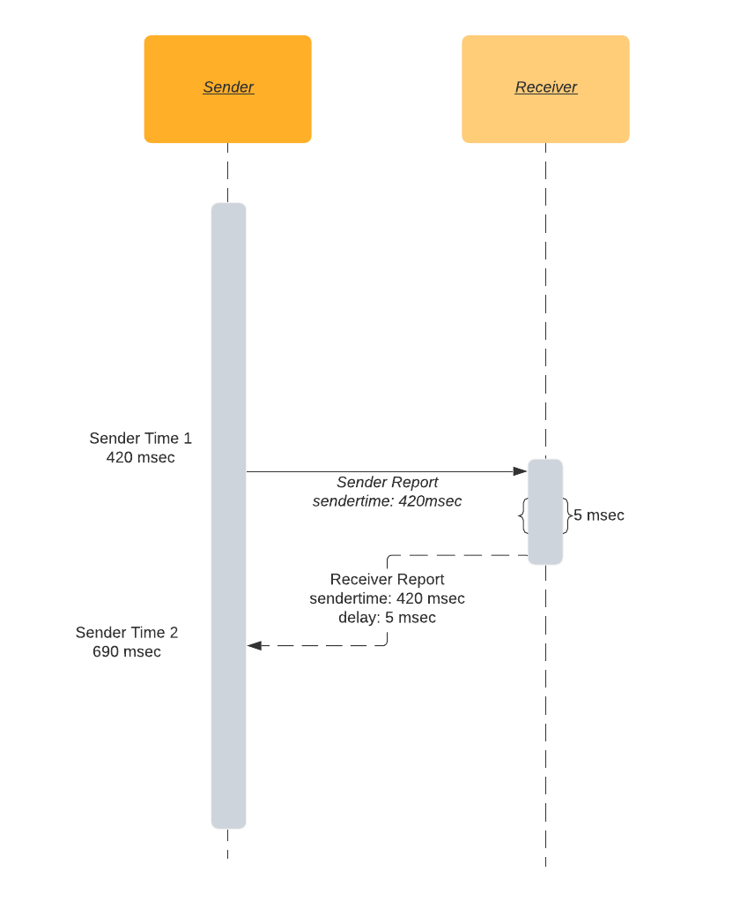

# 미디어 통신

## WebRTC 미디어 통신으로 무엇을 할 수 있나요?

WebRTC는 무제한의 오디오/비디오 트랙을 보낼 수 있고 받을 수 있습니다. 통화 중에도 언제든 스트림을 추가/제거할 수 있으며,
서로 독립적으로 보낼 수도, 하나의 연결로 번들링할 수도 있습니다. 예를 들어 데스크톱 화면 비디오에 웹캠의 오디오/비디오를 함께 보낼 수 있습니다.

WebRTC 프로토콜은 코덱에 중립적입니다. 기저 전송은 존재하지 않는 형식까지도 이론상 지원할 수 있습니다. 다만 상대 에이전트가 해당 코덱을
처리할 수 있어야 합니다.

또한 WebRTC는 동적인 네트워크 상태에 대응하도록 설계되었습니다. 통화 중 대역폭이 늘거나 줄 수 있고, 갑작스런 패킷 손실도 생길 수 있습니다.
프로토콜은 이러한 상황에 반응해 가능한 최선의 경험을 제공하려고 합니다.

## 어떻게 동작하나요?
WebRTC는 RTP와 RTCP를 사용합니다(둘 다 [RFC 1889](https://tools.ietf.org/html/rfc1889)).

RTP(Real-time Transport Protocol)는 실제 미디어를 운반합니다. 지연/신뢰성 규칙은 강제하지 않지만, 이를 구현할 도구를 제공합니다. 하나의 연결에서
여러 미디어 스트림을 운반할 수 있도록 스트림 모델과, 미디어 파이프라인에 필요한 타이밍/정렬 정보를 제공합니다.

RTCP(RTP Control Protocol)는 통화에 대한 메타데이터를 교환합니다. 포맷이 유연해 원하는 메타데이터를 넣을 수 있습니다. 통화 통계를 전달하고,
패킷 손실 처리, 혼잡 제어 구현에 사용됩니다. 네트워크 변화에 대응하기 위한 양방향 통신을 제공합니다.

## 지연과 품질의 균형
실시간 미디어는 지연과 화질 사이에서 절충이 필요합니다. 더 큰 지연을 허용할수록 더 높은 화질을 기대할 수 있습니다.

### 현실적 제약
모든 제약은 현실 세계 네트워크의 한계에서 옵니다. 극복해야 할 네트워크 특성입니다.

### 비디오는 복잡하다
비디오 전송은 쉽지 않습니다. 예컨대 30분 분량의 무압축 720p 8비트 비디오는 약 110GB가 필요합니다. 4인 회의를 생각하면 불가능합니다. 해법은
압축이며, 당연히 대가가 따릅니다.

## 비디오 101
비디오 압축의 모든 것을 다루지는 않고, RTP가 왜 그렇게 설계되었는지를 이해할 만큼만 설명합니다. 압축은 더 적은 비트로 같은 영상을 표현합니다.

### 손실/무손실 압축
무손실(정보 손실 없음)과 손실(일부 손실 허용) 방식이 있습니다. 무손실은 더 많은 데이터를 전송해야 하므로 지연이 늘고 손실이 늘어납니다.
RTP에서는 보통 손실 압축을 사용합니다.

### 인트라/인터 프레임 압축
인트라 프레임은 단일 프레임 내부에서 중복을 줄입니다(JPEG과 유사). 인터 프레임은 연속된 프레임 간 중복을 줄입니다.

### 인터 프레임 종류
* I-프레임: 완전한 그림, 단독 디코딩 가능
* P-프레임: 이전 그림 대비 변경분만 포함
* B-프레임: 이전/이후 그림을 모두 참조해 변경분만 포함

### 비디오는 섬세하다
비디오 압축은 강한 상태성을 갖습니다. I-프레임의 일부를 잃으면? P-프레임은 무엇을 수정해야 하는지 어떻게 알까요? 복잡해질수록 문제는 커집니다.
다행히 RTP/RTCP가 해법을 가지고 있습니다.

## RTP
### 패킷 형식(요점)
RTP 헤더에는 버전, 페이로드 타입(코덱 식별), 시퀀스 번호(손실/재정렬 판단), 타임스탬프(동기화), SSRC(스트림 식별) 등이 포함됩니다. 시퀀스 번호는
패킷 손실/순서 판단에, 타임스탬프는 디코딩/재생 타이밍에 쓰입니다.

## RTCP
RTCP 패킷은 다양한 타입이 있습니다. 공통 헤더에는 버전, 패딩, 리포트 개수, 패킷 타입, 길이, 페이로드가 옵니다.

자주 보는 타입은 다음과 같습니다.
* 192: FIR(Full INTRA-frame Request)
* 193: NACK(Negative ACKnowledgement)
* 200: Sender Report
* 201: Receiver Report
* 205: Generic RTP Feedback
* 206: Payload Specific Feedback

### FIR와 PLI
FIR/PLI는 모두 키프레임(I-프레임) 재전송을 요청합니다. [RFC 5104](https://tools.ietf.org/html/rfc5104)에 따르면 손실 상황에는 PLI를,
그 외(예: 새 참가자 입장)에는 FIR을 사용합니다. 실무에서는 두 경우 모두 인코더에 키프레임 생성을 요청합니다.

### NACK
NACK은 특정 RTP 패킷 하나의 재전송을 요청합니다. RTP가 작은 조각으로 나뉘어 있어, 프레임 전체 재전송보다 대역폭 효율이 좋습니다. 송신자가
해당 패킷을 보유하지 않으면 무시됩니다.

### 송신/수신 리포트(SR/RR)
엔드포인트 간 통계(손실률, 누적 손실, 최고 시퀀스, 지터, 송신 시각 등)를 주고받습니다. RTT 계산과 혼잡 제어에 사용됩니다.

RTT 계산은 다음과 같습니다.

`rtt = sendertime2 - sendertime1 - DLSR`

## 함께 문제를 푸는 방식

### 순방향 오류 정정(FEC)
요청을 기다리지 않고 여분 데이터를 함께 보내 손실에 대비합니다. 손실이 지속적이면 NACK보다 지연이 적습니다.

### 적응형 비트레이트와 대역폭 추정
세션 중 가용 대역폭은 크게 변할 수 있습니다. 인코딩 비트레이트를 예측/현재/미래 대역폭에 맞춰 조정합니다. 이를 위해 대역폭 추정 알고리즘과
네트워크 특성 교환이 필요합니다.

## 네트워크 상태의 식별과 교환
WebRTC는 양방향으로 대역폭, RTT, 지터, 손실을 관측/전달해야 합니다. 대표적인 접근은 다음과 같습니다.

### Receiver/Sender Reports(RR/SR)
[RFC 3550](https://tools.ietf.org/html/rfc3550#section-6.4) 정의. RR이 네트워크 품질(손실, RTT, 지터)을 보고하고, 송신자는 이를 바탕으로 비트레이트를
추정/조정합니다. 필드에는 Fraction Lost, Cumulative Lost, Extended Highest Seq, Interarrival Jitter, Last SR Timestamp 등이 포함됩니다.

### TMMBR/TMMBN, REMB, TWCC와 GCC

#### GCC(Google Congestion Control)
손실 기반 컨트롤러와 지연 기반 컨트롤러를 결합해 대역폭을 추정합니다([draft-ietf-rmcat-gcc-02](https://tools.ietf.org/html/draft-ietf-rmcat-gcc-02)).
수신측 피드백(TMMBR/TMMBN/REMB) 또는 송신측 피드백(TWCC)과 함께 동작합니다.

#### TMMBR/TMMBN, REMB
수신측이 허용 비트레이트를 알려 송신자가 인코더 비트레이트를 조정합니다. 인코더 편차, 규격화 미흡 등 한계가 있어 실무에서는 세심한 튜닝이 필요합니다.

#### TWCC(Transport-Wide Congestion Control)
패킷 도착 시간을 송신자에 상세히 제공해, 송신자가 직접 지연 변동/손실을 추정하고 빠르게 조정합니다. SR/RR의 송신자 중심성과 REMB의 정밀 측정을
절충한 방식입니다.

송신자는 보낸 패킷의 크기/타임스탬프/시퀀스를 추적하고, 수신 리포트의 도착 간격과 비교해 혼잡을 감지합니다.

### 대역폭 추정의 대안
가장 널리 쓰이는 구현은 "Google Congestion Control"입니다. 대안으로 NADA, SCReAM 등이 있습니다.

