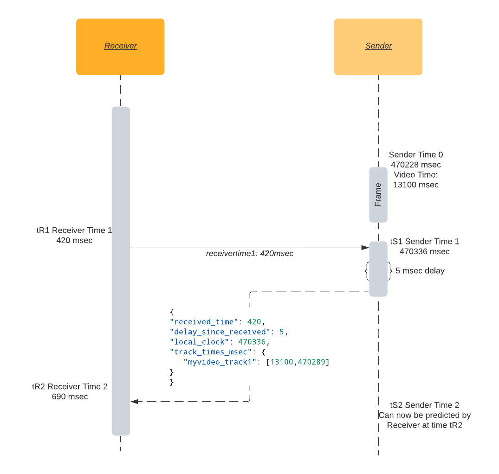

# 디버깅
WebRTC 디버깅은 만만치 않습니다. 구성요소가 많고, 각자 독립적으로 실패할 수 있습니다. 잘못된 부분을 오래 들여다보느라 시간을 낭비하기 쉽습니다.
이 장은 문제를 분해하고, 인기 있는 도구로 진단하는 방법을 안내합니다.

## 문제를 격리하라
어디에서 문제가 비롯되는지 초기에 구분하세요.

### 시그널링 실패
시그널링 채널이 연결되고, SDP/ICE 후보가 정상적으로 교환되는지부터 확인합니다.

### 네트워킹 실패
STUN 서버를 `netcat`으로 점검할 수 있습니다.

1) 20바이트 바인딩 요청 패킷 준비

```
echo -ne "\x00\x01\x00\x00\x21\x12\xA4\x42TESTTESTTEST" | hexdump -C
```

2) 요청 전송 후 32바이트 응답 확인

```
stunserver=stun1.l.google.com;stunport=19302;listenport=20000;echo -ne "\x00\x01\x00\x00\x21\x12\xA4\x42TESTTESTTEST" | nc -u -p $listenport $stunserver $stunport -w 1 | hexdump -C
```

XOR 계산을 단순화하려면 매직 쿠키를 0으로 둔 더미 요청을 보낼 수 있습니다.

```
stunserver=stun1.l.google.com;stunport=19302;listenport=20000;echo -ne "\x00\x01\x00\x00\x00\x00\x00\x00TESTTESTTEST" | nc -u -p $listenport $stunserver $stunport -w 1 | hexdump -C
```

### 보안 실패
DTLS 핸드셰이크가 완료되는지, 인증서 지문이 SDP와 일치하는지 확인합니다.

### 미디어 실패
코덱/포맷 호환, 카메라/마이크 권한, 트랙 추가 상태(`addTrack`)와 수신(`ontrack`) 발생 여부를 확인합니다.

### 데이터 실패
데이터 채널 오픈(DCEP 교환)과 메시지 송수신, 백프레셔/버퍼 상태를 점검합니다.

## 흔히 쓰는 도구

### netcat (nc)
TCP/UDP 연결로 송수신을 수행하는 네트워크 유틸리티입니다.

### tcpdump
패킷 캡처/헥사덤프 도구입니다.

- UDP 19302 포트 캡처: `sudo tcpdump 'udp port 19302' -xx`
- PCAP 저장: `sudo tcpdump 'udp port 19302' -w stun.pcap` (Wireshark로 열기)

### Wireshark
GUI 기반의 강력한 패킷 분석기입니다.

### webrtc-internals
Chrome의 통계 페이지: `chrome://webrtc-internals`

## 지연 측정
지연을 줄이려면 먼저 정확히 측정해야 합니다. 이상적인 방법은 종단 간 지연을 측정하는 것입니다(카메라 캡처, 인코딩, 전송, 수신, 디코딩, 디스플레이, 큐잉 포함).

### DIY 측정(수동)
- 카메라를 밀리초 단위 시계를 향하게 합니다.
- 같은 장소의 수신기로 영상을 보냅니다.
- 휴대폰으로 시계와 수신 화면을 동시에 찍습니다.
- 두 시각의 차이를 구합니다.

.


### 자동 측정(호환 방식)
NTP 스타일로 DataChannel을 이용해 송신자/수신자 단조 시계를 동기화하고, 비디오 트랙 시간과 대조해 지연을 추정합니다.



핵심 개념:

```
expected_video_time = tSV1 + time_since(tSV1)
latency = expected_video_time - actual_video_time
```

샘플 메시지 포맷(송신자 응답):

```json
{
  "received_time": 64714,
  "delay_since_received": 46,
  "local_clock": 1597366470336,
  "track_times_msec": {
    "myvideo_track1": [13100, 1597366470289]
  }
}
```

수신기에서 데이터채널 열기:

```javascript
dataChannel = peerConnection.createDataChannel('latency');
```

주기적으로 수신기 시간 전송:

```javascript
setInterval(() => {
  let tR1 = Math.trunc(performance.now());
  dataChannel.send(String(tR1));
}, 2000);
```

송신기 처리 및 응답:

```javascript
// event.data 예: "1234567"
const tR1 = Number(event.data);
const now = Math.trunc(performance.now());
const tSV1 = 42000; // 현재 프레임 RTP 타임스탬프(ms)
const tS1 = 1597366470289; // 현재 프레임 단조 시계
const msg = {
  received_time: tR1,
  delay_since_received: 0,
  local_clock: now,
  track_times_msec: { myvideo_track1: [tSV1, tS1] }
};
dataChannel.send(JSON.stringify(msg));
```

수신기에서 지연 추정:

```javascript
let tR2 = performance.now();
let fromSender = JSON.parse(event.data);
let tR1 = fromSender.received_time;
let delay = fromSender.delay_since_received;
let senderTimeFromResponse = fromSender.local_clock;
let rtt = tR2 - delay - tR1;
let networkLatency = rtt / 2;
let senderTime = senderTimeFromResponse + delay + networkLatency;

VIDEO.requestVideoFrameCallback((now, framemeta) => {
  senderTime += (now - tR2);
  let [tSV1, tS1] = Object.entries(fromSender.track_times_msec)[0][1];
  let timeSinceLastKnownFrame = senderTime - tS1;
  let expectedVideoTimeMsec = tSV1 + timeSinceLastKnownFrame;
  let actualVideoTimeMsec = Math.trunc(framemeta.rtpTimestamp / 90);
  let latency = expectedVideoTimeMsec - actualVideoTimeMsec;
  console.log('latency', latency, 'msec');
});
```

### 브라우저에서 실제 비디오 시간
`HTMLVideoElement.requestVideoFrameCallback()`으로 현재 표시된 비디오 프레임의 시간(및 WebRTC의 경우 `rtpTimestamp`)에 접근할 수 있습니다.

### 지연 디버깅 팁
- 설정을 단순화해 문제 재현 최소 구성을 만드세요.
- 카메라: 자동 노출/초점/화이트밸런스가 지연을 늘릴 수 있습니다(Linux: `v4l2-ctl`).
- 인코더: B-프레임/레퍼런스 프레임이 지연을 늘립니다(x264: `tune=zerolatency`, `profile=baseline` 권장).
- 네트워크: RTT는 지연의 하한입니다. NACK/PLI가 늘면 지연 증가 요인입니다(webrtc-internals의 `nackCount`, `pliCount` 확인).
- 수신측: 패킷 무질서/재조립 대기 시간이 지연을 늘립니다(`jitterBufferDelay` 확인).

